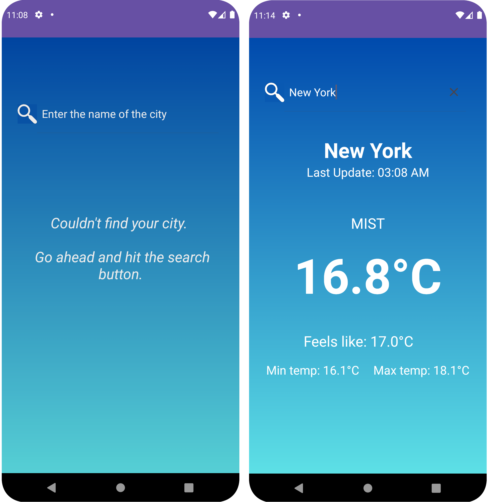

<h1 align="center" style="font-weight: bold;">App Weather Information ⛅</h1>

    <b>A simple Android weather application implemented using the MVVM pattern, Retrofit2, 
      Dagger Hilt, LiveData, ViewModel, Coroutines. App Weather Information
      fetches data from the OpenWeatherMap API to provide real time weather information.  </b>

<h2 id="layout">🎨 Layout</h2>

    

<h2 id="technologies">💻 Technologies used:</h2>

- <a href="https://dagger.dev/hilt/">Dagger Hilt</a> is for dependency injection
- <a href="https://square.github.io/retrofit/">Retrofit</a> is a REST Client for Android which makes easier to retrieve and upload structured data like JSON via REST.
- <a href="https://developer.android.com/topic/libraries/architecture/viewmodel">ViewModel</a> is a class designed to store and manage UI-related data in a conscious way.
- <a href="https://developer.android.com/topic/libraries/architecture/livedata">Live Data</a> observes changes in the data and automatically update the UI when the data changes.
- <a href="https://kotlinlang.org/docs/reference/coroutines-overview.html">Coroutines</a> are a tool for managing asynchronous operations, which allow tasks to run without blocking
  the main thread, improving app responsiveness.

<h2 id="technologies">Architecture</h2>

- Pattern <a href="https://en.wikipedia.org/wiki/Model%E2%80%93view%E2%80%93viewmodel">Model-View-ViewModel</a> (MVVM) which is a software architectural pattern that separates an
  application's user interface (the View) from its underlying data and business logic (the Model and ViewModel).

<h2 id="technologies">Installation</h2>

This application requires a minimum API level of 24. Clone the repository. Also you will need an API key from the Open Weather site to request weather data. If you don’t have an account, 
you will have to create one in order to request an API Key.

<h2 id="license">License 📃 </h2>

This project is under [MIT](./LICENSE) license
  
